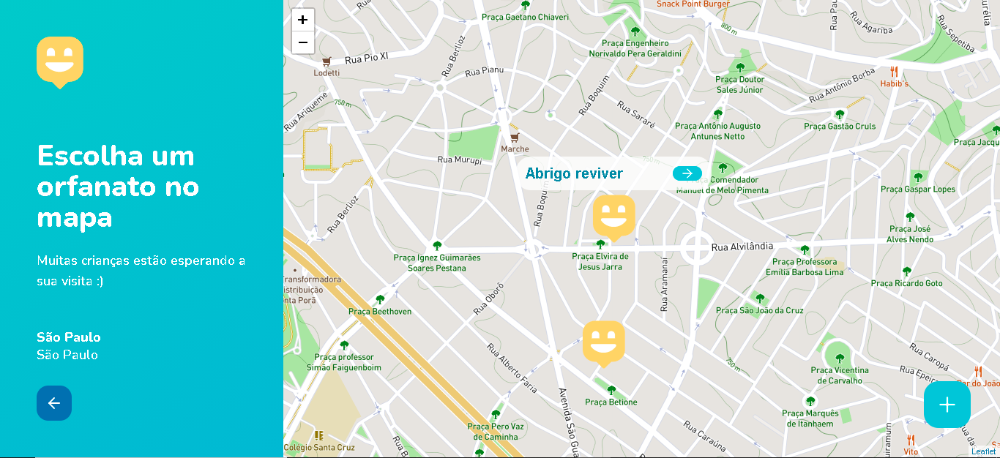

# Next Level Week 3

<h4 align="center">Happy landing page</h4>
<p align="center">
  
</p>

<h4 align="center">Happy maps page</h4>
<p align="center">
  
</p>

## 🛠 Tecnologias

As seguintes tecnologias foram usadas na construção do projeto:

- Node.js
- React
- TypeScript

## 🎲 Instalação

Para executar este projeto, você deve possuir o Node e o Yarn instalado para configurar todas as dependências.

```shell
- Clone o repositório:
cd "diretorio de sua preferência"

$ git clone https://github.com/Deimos177/NLW3Happy.git

- Para instalar as dependências frontend, backend e mobile:
$ yarn

- Execute a aplicação frontend:
$ yarn start

- Abra seu browser em:
http://localhost:3000/

- Para executar projeto backend:

$ yarn dev

- Para executar projeto mobile:

$ yarn start

- Abra com emulador ou instalando expo dentro do seu dispositivo móvel.
```

## ✅ Author

**Bruce Vieira**